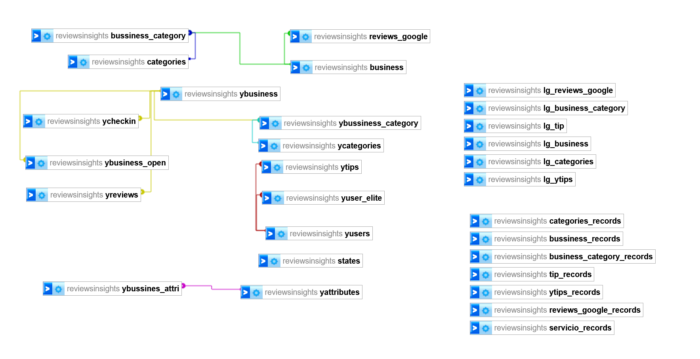

<h1 align='center'>
 <b>Review Insights - Análisis de Reseñas y Recomendaciones</b>
</h1>

.

## **Introducción**

`Review Insights` es una empresa de análisis de datos que tiene como objetivo proporcionar información valiosa a otras empresas sobre las reseñas y recomendaciones que reciben de los usuarios en plataformas como Yelp y Google Maps. Nuestro enfoque principal es recopilar, analizar y ofrecer información significativa sobre las experiencias de los usuarios en diferentes comercios.

## **Contexto**

La industria vinícola se destaca por su enfoque único en la valoración de la marca a través de opiniones personales y recomendaciones de expertos en guías especializadas, así como del poderoso efecto del boca a boca entre los consumidores. Estados Unidos, conocido tradicionalmente por su cultura cervecera, ha experimentado un crecimiento constante en el consumo de vino en los últimos años. Esta tendencia positiva representa una oportunidad valiosa para comercializar productos vinícolas en el país.

La capacidad de identificar y clasificar a los `reviewers` en profesionales o consumidores circunstanciales, junto con el análisis comparativo de las calificaciones otorgadas por ambos grupos, permitirá a las empresas entender mejor el impacto de las opiniones expertas y del público general en la percepción y éxito de sus establecimientos.

Adicionalmente, la estimación realizada por estudios de marketing, sobre el aumento del consumo de vino en los años venideros fortalece aún más la relevancia del proyecto. La información proporcionada por esta plataforma será invaluable para las empresas vinícolas en sus esfuerzos de marketing, toma de decisiones estratégicas y mejora continua de la calidad del servicio.

## **Problematica**:

En el contexto de la industria vinícola en Estados Unidos, las empresas enfrentan el desafío de evaluar la percepción y opinión de los usuarios sobre sus bodegas y bares o clubes de vinos. La creciente tendencia en el consumo de vino en el país, junto con la importancia que los clientes otorgan a las reseñas y recomendaciones, demanda una comprensión profunda de las experiencias vividas por los usuarios en estos establecimientos.

La falta de una herramienta efectiva para identificar a aquellos reviewers con expertise en vinos y diferenciarlos de los consumidores circunstanciales, así como la necesidad de evaluar las calificaciones promedio otorgadas por ambos grupos para distintas bodegas y bares de vino, representa una problemática crucial para las empresas del sector. Además, es esencial comprender qué aspectos priorizan los reviewers en sus comentarios, especialmente en los primeros y últimos, para mejorar la calidad del servicio y la satisfacción del cliente.

## **Alcances y Objetivo**:

Vamos a tomar los datos de todos los estados de Esatdos unidos como primer instancia, porque el volumen de los mismos nos ayuda para un mejor analisis.
El objetivo principal de nuestro proyecto, es proporcionar a las empresas del sector vinícola una valiosa visión sobre las experiencias y opiniones de los usuarios en relación con bodegas y bares o clubes de vinos en Estados Unidos. A través de un análisis exhaustivo de las reseñas y recomendaciones, buscamos identificar a aquellos reviewers que han puntuado establecimientos vinícolas de manera significativa, determinando así a los conocedores con expertise en vinos.

Uno de nuestros enfoques clave es la categorización de los`reviewers` en dos grupos distintos: profesionales y consumidores circunstanciales. Mediante esta clasificación, pretendemos evaluar el score promedio otorgado por cada grupo con relación a diferentes bodegas o bares de vino. De esta manera, podremos identificar posibles diferencias en sus opiniones, permitiendo a las empresas entender mejor el impacto de las opiniones expertas y del público general en la percepción y éxito de sus establecimientos
 

Además, en nuestro análisis, prestamos especial atención a qué aspectos priorizan los reviewers en sus comentarios, especialmente enfocándonos en los primeros y últimos comentarios. Esto brindará información valiosa a las empresas para comprender qué aspectos de sus servicios o productos reciben mayor atención y cómo pueden mejorar la experiencia del cliente.

Como se explicó en el contexto, el mercado vitivinícola, caracterizado por su énfasis en la valoración de la marca a través de opiniones personales y recomendaciones de expertos, ofrece una oportunidad única para este proyecto.

Nuestra misión es convertir el conocimiento de las experiencias del cliente en una herramienta valiosa para el éxito empresarial en el dinámico y creciente mercado vinícola de Estados Unidos.

## **KPI`s**

Los KPIs que encontramos mediante el analisis exploratorio de los datos fueron :

1. **Cantidad de Reviewers Identificados como Conocedores de Vinos:** Este KPI está directamente relacionado con nuestro objetivo principal. Buscamos identificar a los usuarios que poseen experiencia y conocimiento en el mundo del vino. Esta métrica nos permite aprovechar opiniones de expertos que aportan un alto valor en sus evaluaciones.Una vez que los identifiquemos queremos llegar a ver un aumento sucesivo de los mismos mediante el uso de la herramienta, incrementando de manera progresiva proponiendo un aumento del 10%

2. **Distribución de Reviewers según su Categoría:**  Este KPI proporciona información crucial sobre la composición de los usuarios que realizan reseñas. Al analizar esta distribución, podremos determinar si estamos atrayendo principalmente a reviewers profesionales con un conocimiento sólido en vinos o si la mayoría son consumidores casuales.Queremos medir localizaciones de esos comentarios por lo que apuntamos a que a mayor rango geografico y mayores reseñas hay un potencial de expertis

3. **Score Promedio de Expertos y Aficionados:** Al comparar los scores promedio entre reviewers profesionales y amateurs, estaremos en condiciones de evaluar el impacto que tienen las opiniones de los expertos en la calificación general de bodegas y bares de vinos. Este KPI nos ayudará a comprender si las voces de los conocedores influyen significativamente en la percepción del lugar.El score promedio debe ser mayor y aumentar (mas del 5%) con el tiempo para que sea significativo.

4. **Comparativa de Score Promedio de Bodegas o Bares de Vinos:** Este KPI nos permitirá identificar y destacar los establecimientos mejor valorados por los revisores. Esta información será extremadamente valiosa para las empresas, ya que podrán ajustar sus estrategias y mejorar su desempeño basándose en los aspectos que destacan en las opiniones positivas.El score deberia mantenerse o aumentar (mas del 5%) para que este indicador muestre mejora.

5. **Volumen de Reseñas por Establecimiento:** Este KPI refleja la popularidad y la satisfacción general de los clientes en cada lugar. Cuantas más reseñas reciba un establecimiento, más visible será su experiencia para el público en general. Este KPI se convierte en un barómetro clave para evaluar la aceptación del público y la calidad del servicio ofrecido.Se piensa como ramping de mejora que haya una mejora del 10% en un principio.

## **Implementación del Stack Propuesto**

Hemos seleccionado un stack tecnológico que nos permitirá llevar a cabo el análisis de datos y la generación de modelo de manera efectiva:

1. ` Power BI`: Utilizaremos Power BI para crear visualizaciones interactivas y paneles de control que permitan a las empresas explorar y entender los datos de manera intuitiva. Es la  herramienta de visualización que mejor manejamos con el equipo.

2. `ETL Automatizado`: Implementaremos un proceso ETL (Extract, Transform, Load) automatizado en la nube para recopilar y procesar los datos de reseñas y recomendaciones de las plataformas en línea. Decidimos utilizar la que ya nos brinda Azure.

3. `Servicios en la Nube`: Almacenaremos y procesaremos los datos en servicios en la nube de `Azure` para garantizar su disponibilidad y escalabilidad.La eleccion estuvo basada en la cantidad de servicios que nos ofrecia el proveedor y la cantidad de documentacion y las recomendaciones de otros usuarios acerca del cobro de los servicios.

4. `Python y Librerías`: Utilizaremos el lenguaje de programación Python junto con librerías como pandas, NumPy y scikit-learn para realizar el análisis de datos y la creación del modelo. 

5. `Trello`: elegimos esta herramienta para poder ordenar el trabajo en equipo y para poder seguir un flujo de trabajo.

5. `Canva`: usamos esta herramienta para poder apoyarnos visualmente en las demos del proyecto, así como para la generación de imágenes de nuestra autoría.

Por supuesto, aquí tienes una versión mejorada del texto que describe el proceso de ETL realizado en Azure para el Data Warehouse utilizando los datasets de Google y Yelp. Esta versión está más estructurada y clara:

## **Proceso ETL en Azure Data Warehouse**

El proceso ETL (Extract, Transform, Load) del almacén de datos consistió en incorporar y procesar conjuntos de datos de Google y Yelp. El objetivo era crear un conjunto de datos completo para el análisis y la comprensión de los establecimientos relacionados con el vino. El proceso se diseñó para garantizar la precisión de los datos, las actualizaciones incrementales y una transformación eficaz.

### **Ingesta y almacenamiento de datos**

El almacén de datos se construyó utilizando los servicios Azure, y los conjuntos de datos de Google y Yelp se introdujeron en contenedores de bloques para su almacenamiento y posterior procesamiento. este es el esquema de las tablas con sus claves : 

### **Actualizaciones Incrementales y ETL Básico**

Para los conjuntos de datos que constituían tablas de dimensiones, se implementó un enfoque de actualización incremental. Esto se logró mediante la función Dataflow de Azure Data Factory. Dataflow permite la creación de pipelines que aplican operaciones ETL básicas a un conjunto de datos y luego transfieren los datos transformados a una base de datos MySQL. Este enfoque resultó eficaz para gestionar tablas de dimensiones en las que los cambios de datos a lo largo del tiempo son menos frecuentes.

### **Actualizaciones incrementales impulsadas por canalizaciones**

Para los conjuntos de datos que requerían transformaciones y actualizaciones más complejas, se adoptó un enfoque de canalización. Esto implicaba la supervisión de una carpeta designada dentro del contenedor de bloques. Cada vez que llegaba un nuevo conjunto de datos, se activaba la ejecución de un cuaderno en Azure Databricks. El cuaderno contenía lógica ETL avanzada para actualizar varias tablas de la base de datos. Este enfoque basado en canalizaciones resultó especialmente útil para actualizar las tablas de dimensiones y hechos.

### **Control de calidad de los datos**

El control de calidad de los datos fue una consideración clave durante todo el proceso ETL. Para garantizar la integridad de los datos cargados, se comprobaron y gestionaron las filas duplicadas. Esta verificación se realizó de forma programática, ya fuera mediante automatización o secuencias de comandos en Azure Databricks.

### **Verificación automatizada y guionizada**

El proceso de verificación consistía en comprobar si había filas duplicadas antes de cargarlas en la base de datos. En caso de duplicación, la carga de datos se gestionaba automáticamente o mediante scripts personalizados. Este paso era crucial para mantener la precisión y coherencia de los datos.

Al estructurar el proceso ETL de esta manera, pudimos gestionar eficazmente los datos de múltiples fuentes, aplicar las transformaciones adecuadas, garantizar actualizaciones incrementales y mantener los estándares de calidad de los datos. Este sólido proceso ETL sentó las bases para un análisis preciso y profundo dentro del almacén de datos.

Para más detalles sobre los scripts, pipelines y transformaciones específicos aplicados durante el proceso ETL, consulte el código y la documentación pertinentes en el repositorio del proyecto[Código](https://github.com/mariangigena/proyectogrupal/blob/main/scripts/metadata_sitios_unir_jsons.ipynb)

## Documentacion 
1- [Analisis sobre el mercado vitivinicola](https://www.tecnovino.com/estados-unidos-el-pais-que-mas-gasta-en-vino-del-mundo/).

2- [Caso de estudio de exportacion de vinos a California](https://es.scribd.com/document/499977209/Dialnet-ExportacionDeVinoTintoAlEstadoDeCalifornia-7242720)

3- [Diccionario de los Dataset](https://docs.google.com/spreadsheets/d/1yqzhAJYQmZR4UNs7w-sYEJx5k-rC_-pfw1gnUHxsuPc/edit#gid=0)

## Integrantes del grupo :

**Diego Forcato** [Linkedin](https://www.linkedin.com/in/diegoforcato)

**Fernando Mubarqui** [Linkedin](https://www.linkedin.com/in/fernando-mubarqui-540136106/)

**Harlan Tonguino** [Linkedin](https://www.linkedin.com/in/harlan-37048a174/)

**Renar Zamora** [Linkedin](https://www.linkedin.com/in/renar-arnoldo-zamora-54bb9024/)

**Mariana Gigena** [Linkedin](https://www.linkedin.com/in/mariana-gigena/)

